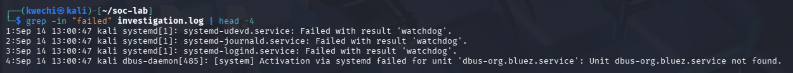
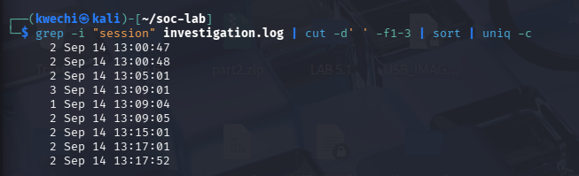
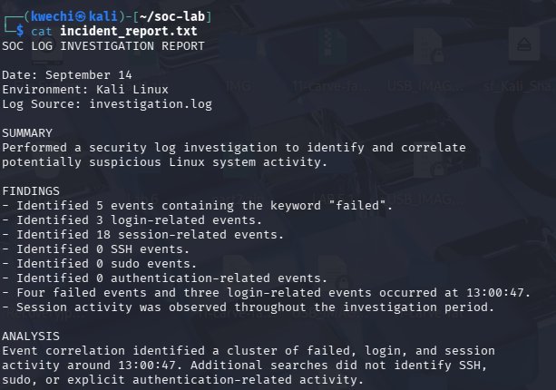

## Investigation Screenshots

### 1. Failed Event Detection

Filtered the investigation log to identify failed system events. Multiple failed events occurring at the same timestamp were identified for further investigation.

### 2. Timestamp Correlation

Aggregated session-related events by timestamp using Linux command-line tools to identify activity patterns during the investigation window.

### 3. SOC Investigation Report

Documented the investigation findings and analysis after correlating failed, login, and session-related activity.

- Incident documentation
